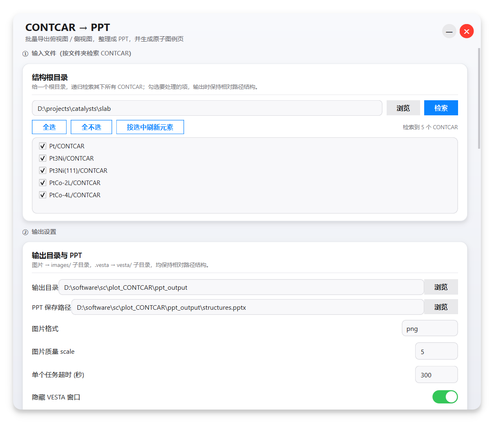

<div align="center">

# plot-CONTCAR 🧪🖼️

**把 VASP 的 `CONTCAR` / `POSCAR` 一键变成漂亮的「俯视图 + 侧视图」结构图，并自动整理进 PPT**

[](https://github.com/moyulyy/plot-CONTCAR/releases)
[](LICENSE)
[](#-环境要求)
[](#-环境要求)
[](#-gui-使用)
[](https://jp-minerals.org/vesta/)

一个 **iOS 风格** 的本地 GUI 工具（同时提供命令行 / Python API）：给出一个根目录，
递归找出其中所有 `CONTCAR`，批量导出 **俯视图 / 侧视图**，自动整理成 **PPT**，
并追加一页 **原子 ball + label 图例**。所有 VESTA 出图参数都做成了开关与输入框，无需改代码。



</div>

---

## ✨ 特性

|   | 功能 | 说明 |
| :-: | :--- | :--- |
| 🗂️ | **按目录检索** | 指定一个根目录，递归检索所有 `CONTCAR` 文件，勾选需要的项 |
| 🌳 | **保持相对路径** | 导出的图片与 `.vesta` 完全镜像输入目录结构，便于归档对照 |
| 🔭 | **俯视 / 侧视图** | 俯视图沿 *c* 轴、侧视图 *c* 轴竖直（可选沿 *a* / *b* 轴看） |
| 🎛️ | **参数全界面化** | 坐标轴 / 晶胞边界 / 化学键 / 显示边界 / 缩放平移 / 原子半径颜色 / 视角 / 画质 / 超时… |
| 🧬 | **原子样式自动** | 自动读取结构中的元素并去重，填入默认半径与颜色（Jmol 配色） |
| 📊 | **一键生成 PPT** | 标题页 + 每个结构一页（俯视 / 侧视对照）+ 原子图例页 |
| 🔵 | **原子图例页** | 用真实原子颜色渲染带高光的 3D 小球，球 + 元素标签一一对应 |
| 🪟 | **后台静默出图** | 用隐藏窗口（伪无头）调用 VESTA，屏幕不弹窗、可无人值守 |
| 🕶️ | **iOS 风格界面** | 无边框圆角弹窗、卡片阴影、滑动开关、胶囊按钮，支持高 DPI |
| 📦 | **零配置启动** | 双击 `启动GUI.lnk` / `.vbs` 即可（无命令行黑框） |

---

## 🚀 快速开始

### 方式一：GUI（推荐）

```bat
:: 双击以下任一文件即可
启动GUI.lnk      :: 无黑框，最省心
启动GUI.vbs      :: 无黑框
启动GUI.bat      :: 几乎无黑框
```

或手动运行：

```bat
D:\miniconda3\envs\chem_env\pythonw.exe gui_launcher.pyw
```

### 方式二：命令行（`vesta_tools.py`）

```bat
:: 1) 只转换格式：CONTCAR -> CONTCAR.vesta
python vesta_tools.py examples\CONTCAR --no-image

:: 2) 转格式 + 后台出图（默认不调整视角）
python vesta_tools.py examples\CONTCAR -o preview.png --scale 5

:: 3) 转换 + 改样式 + 出图（关闭坐标轴、生成化学键、缩放 1.2、指定原子颜色/半径）
python vesta_tools.py examples\CONTCAR -o styled.png --scale 5 ^
    --comps OFF --sbond ON --scale-frac 1.2 --atom-radius O=0.8 --atom-color O=255,0,0
```

### 方式三：Python API

```python
from vesta_tools import Vesta

v = Vesta()                                   # 默认隐藏窗口（伪无头）
v.contcar_to_vesta("examples/CONTCAR")        # CONTCAR -> .vesta
v.contcar_to_image(                            # 一步：转格式 ->（改样式）-> PNG
    "examples/CONTCAR", "a.png", scale=5,
    modify={"comps": "OFF", "sbond": "ON", "scale_frac": 1.2},
)
```

---

## 🖼️ 输出结构

给定根目录：

```text
structures/
├── CONTCAR
├── Pt/CONTCAR
└── Pt3Ni(111)/CONTCAR
```

处理后在输出目录得到（**相对路径原样保留**）：

```text
output/
├── structures.pptx                     # 汇总 PPT（标题页 + 结构页 + 原子图例页）
├── images/
│   ├── CONTCAR_top.png                 # 俯视图
│   ├── CONTCAR_side.png                # 侧视图
│   ├── Pt/
│   │   ├── CONTCAR_top.png
│   │   └── CONTCAR_side.png
│   └── Pt3Ni(111)/
│       ├── CONTCAR_top.png
│       └── CONTCAR_side.png
└── vesta/
    ├── CONTCAR.vesta                   # 已应用显示设置后的 .vesta
    ├── Pt/CONTCAR.vesta
    └── Pt3Ni(111)/CONTCAR.vesta
```

PPT 每一页示例：

| 页 | 内容 |
| :-: | :--- |
| 1 | 标题页（结构数量、生成时间） |
| 2…N | 每个结构一页：**俯视图 + 侧视图** 并排，标注相对路径 |
| 末页 | **原子图例**：每个元素一个 3D 小球 + 元素标签 |

<div align="center">
  
  <br>
  <sub>由 <code>examples/CONTCAR</code> 经 VESTA 渲染（<code>scale=3</code>）</sub>
</div>

---

## 🖥️ GUI 使用

界面从上到下分为 7 个区：

| 区 | 名称 | 主要项 |
| :-: | :--- | :--- |
| ① | **输入文件** | 结构根目录（浏览 / 检索）、结果列表（勾选）、全选 / 全不选 / 按选中刷新元素 |
| ② | **输出设置** | 输出目录、**PPT 保存路径**、图片格式、画质 `scale`、超时、隐藏窗口、输出 `.vesta`、VESTA.exe 路径 |
| ③ | **视图设置** | 生成俯视图 / 侧视图、侧视方向（沿 b / 沿 a 轴看）、额外旋转 X/Y/Z、**图片排版**、**图片占页面比例**（默认 0.8）、**裁剪空白边距** |
| ④ | **VESTA 显示** | `COMPS` / `UCOLP` / `SBOND` 开关、成键容差、`scale_frac`、`x/y_move`、显示边界 `BOUND`（默认 `-0.05 ~ 1.05`） |
| ⑤ | **原子样式** | 元素 / 半径 / 颜色，检索后按结构元素自动填充（可增删） |
| ⑥ | **图例页** | 是否生成、球体直径、每行数量、是否标注半径、图例位置 |
| ⑦ | **运行** | 开始 / 停止、进度条、实时日志 |

### 出图视角说明

工具通过直接写入 `.vesta` 的 `SCENE` 矩阵来精确控制视角：

| 视图 | SCENE 矩阵 | 含义 |
| :--- | :--- | :--- |
| 俯视图 | `[1,0,0, 0,1,0, 0,0,1]` | 沿 *c* 轴俯视 |
| 侧视图（沿 b） | `[1,0,0, 0,0,1, 0,-1,0]` | *a* 横、*c* 竖 |
| 侧视图（沿 a） | `[0,1,0, 0,0,1, 1,0,0]` | *b* 横、*c* 竖 |

### 图片排版（约占页面 80%）

- **每页一张**（默认）：俯视图、侧视图各占一页，图片等比缩放到 **约占页面 80%**（上下或左右），并保证 **完整显示、绝不越界裁切**。
- **同页并排**：俯视图 + 侧视图放在同一页，两图合计约占据页面宽度 80%。
- **图片占页面比例**：默认 `0.8`，可调 `0.4 ~ 0.95`。
- **裁剪空白边距**（默认开）：自动裁掉 VESTA 导出图四周的纯白背景，让结构图更紧凑、更大（参考 `mk-ppt` 的包围盒思路）。

---

## 🧰 命令行参数（`vesta_tools.py`）

```text
usage: vesta_tools.py [-h] [-o OUTPUT] [-s SCALE] [--vesta-file VESTA_FILE]
                      [--no-image] [--keep-vesta] [--rotate-x/-y/-z ANGLE]
                      [--comps {ON,OFF}] [--ucolp {ON,OFF}] [--sbond {ON,OFF}]
                      [--boundary a,b,c,d,e,f] [--version a,b,...,i]
                      [--scale-frac F] [--x-move F] [--y-move F]
                      [--sbond-padding F] [--atom-color El=R,G,B] [--atom-radius El=r]
                      [--exe EXE] [--timeout S] [--show-window] [-q]
                      contcar [contcar ...]
```

| 参数 | 说明 | 默认 |
| :--- | :--- | :--- |
| `contcar` | 一个或多个 `CONTCAR` / `POSCAR` | 必填 |
| `-o, --output` | 输出图片（仅单输入可用） | `<CONTCAR>.png` |
| `-s, --scale` | 画质，越大越清晰 | `5` |
| `--no-image` | 仅格式转换，不出图 | `False` |
| `--keep-vesta` | 出图后保留 `.vesta` | `False` |
| `--comps/--ucolp/--sbond` | 坐标轴 / 晶胞边界 / 化学键 开关 | 不改 |
| `--boundary` | 显示边界（6 个分数坐标） | 不改 |
| `--version` | 视角矩阵（9 个数） | 不改 |
| `--scale-frac / --x-move / --y-move` | 缩放与平移 | `1.0 / 0 / 0` |
| `--sbond-padding` | 自动成键键长容差（Å） | `0.5` |
| `--atom-color El=R,G,B` | 原子颜色（可重复） | 不改 |
| `--atom-radius El=r` | 原子半径（可重复） | 不改 |
| `--exe / --timeout / --show-window / -q` | VESTA 路径 / 超时 / 显示窗口 / 静默 | — |

---

## 🛠️ 修改 `.vesta` 内容

`vesta_modify.py` 可在出图前直接修改 `.vesta` 的显示参数：

| 段 | 参数 | 作用 |
| :--- | :--- | :--- |
| `COMPS` | `comps="ON"/"OFF"` | 显示 / 隐藏晶胞坐标轴 |
| `UCOLP` | `ucolp="ON"/"OFF"` | 显示 / 隐藏晶胞边界线 |
| `SBOND` | `sbond="ON"/"OFF"` | 按 `r_a + r_b + padding` 自动生成化学键 |
| `BOUND` | `boundary=[6 个数]` | 显示 / 裁剪边界 |
| `ATOMT` / `SITET` | `atom_params=[{...}]` | 原子半径与颜色 |
| `SCENE` | `version=[9 个数]`、`scale_frac`、`x/y_move_frac` | 视角矩阵、缩放与平移 |

---

## 🧩 项目结构

```text
plot-CONTCAR/
├── vesta_gui.py            # iOS 风格 GUI（PySide6）+ 批量出图 / PPT 逻辑
├── gui_launcher.pyw        # 无控制台启动器（pythonw）
├── vesta_tools.py          # 核心类 Vesta + 命令行入口
├── vesta_modify.py         # .vesta 内容修改（COMPS/UCOLP/SBOND/BOUND/ATOMT/SITET/SCENE）
├── 启动GUI.lnk / .vbs / .bat # Windows 免黑框启动方式
├── requirements.txt
├── docs/
│   └── screenshot.png
├── examples/
│   ├── CONTCAR
│   └── preview.png
├── LICENSE
└── README.md
```

---

## 🖥️ 环境要求

| 项目 | 要求 |
| :--- | :--- |
| 操作系统 | **Windows**（VESTA 出图依赖 GUI / OpenGL 渲染） |
| Python | 3.9+（推荐 `D:\miniconda3\envs\chem_env`） |
| VESTA | 64 位版，默认 `D:\software\VESTA-win64\VESTA-win64\VESTA.exe` |
| 依赖 | `PySide6`、`python-pptx`、`Pillow`、`numpy`（见 `requirements.txt`） |

```bat
pip install -r requirements.txt
```

---

## 🧠 实现细节 & FAQ

<details>
<summary><b>为什么不能真正用 <code>-nogui</code> 无头出图？</b></summary>

VESTA 出图依赖 GUI/OpenGL，真正的 `-nogui` 不会产生图片。本工具仍用 GUI 进程渲染，
但通过 Windows `STARTUPINFO(SW_HIDE)` 把窗口隐藏，实现「不弹窗、无人值守」。
</details>

<details>
<summary><b>为什么导出图片后进程不退出 / 返回码异常？</b></summary>

VESTA 即使带 `-close` 也不会自动退出，且返回码不可靠（成功也可能是 `0xFFFFFFFF`）。
工具以「输出文件存在且非空」为成功判据，并在文件大小稳定后主动结束进程。
</details>

<details>
<summary><b>能找到元素但读不到元素名（VASP4 格式）怎么办？</b></summary>

VASP4 的 `CONTCAR` 第 6 行是原子数而非元素符号，无法自动识别元素；
此时原子样式留空即可，VESTA 会使用默认样式。
</details>

<details>
<summary><b>能在无用户登录的服务 / 计划任务里跑吗？</b></summary>

隐藏窗口仍需要可用的交互式桌面 / 图形会话；无登录场景下 OpenGL 可能不可用。
</details>

---

## 📄 License

本项目基于 [MIT License](LICENSE) 开源。

> VESTA 为第三方软件，版权归其原作者所有，本项目仅调用其命令行接口。

---

<div align="center">
<sub>如果这个工具帮到了你，欢迎点一个 ⭐ Star！</sub>
</div>

---

<details>
<summary><b>English Summary</b></summary>

**plot-CONTCAR** converts VASP `CONTCAR` / `POSCAR` files into VESTA `.vesta` format and exports
**top-view** and **side-view** structure images in batch, then assembles them into a **PPT** with a
dedicated **atom ball + label legend** slide. It ships with an **iOS-style PySide6 GUI**, a CLI
(`vesta_tools.py`), and a Python API. Given a root folder, it recursively finds all `CONTCAR` files,
lets you pick which to process, and preserves the relative folder structure in both the image and
`.vesta` outputs.

Requires Windows, Python 3.9+, VESTA 64-bit, and `PySide6` + `python-pptx`.

</details>
